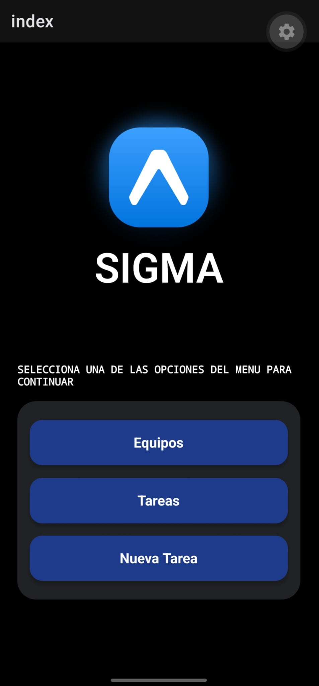
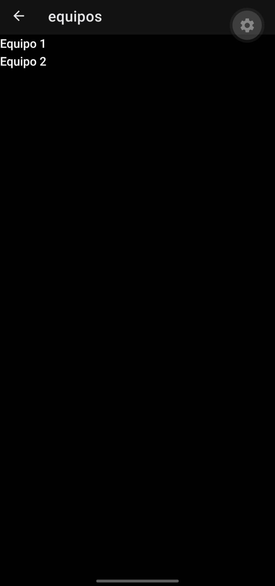

# Actividad SIGMA

## Descripción

En esta actividad se realizó la navegación entre diferentes pantallas de la aplicación SIGMA utilizando Expo Router.

Se creó una pantalla de inicio con tres opciones: Equipos, Tareas y Nueva tarea. También se implementó una ruta dinámica para poder seleccionar un equipo y mostrar su ID.

## Funcionalidades

- Menú principal con las opciones Equipos, Tareas y Nueva tarea.
- Navegación entre pantallas utilizando Link.
- Pantalla de equipos con dos equipos para seleccionar.
- Pantalla de detalle que muestra el ID del equipo seleccionado.
- Uso de Stack para la navegación entre pantallas.

## Tecnologías utilizadas

- React Native
- Expo
- Expo Router
- TypeScript

## Estructura del proyecto

Dentro de la carpeta `src/app` se encuentran las pantallas:

- `index.tsx`: pantalla principal con el menú.
- `equipos.tsx`: muestra los equipos disponibles.
- `tareas.tsx`: pantalla de tareas.
- `nuevatarea.tsx`: pantalla de nueva tarea.
- `_layout.tsx`: contiene el Stack de navegación.
- `equipos/[id].tsx`: recibe y muestra el ID del equipo seleccionado.

## Cómo ejecutar el proyecto

Para ejecutar el proyecto es necesario tener Node.js instalado.

1. Descargar el proyecto desde GitHub.
2. Abrir la carpeta en Visual Studio Code.
3. Abrir una terminal y ejecutar:

   `npm install`

4. Después iniciar la aplicación con:

   `npx expo start`

5. Abrir la aplicación utilizando Expo Go en el celular o desde el navegador

## Capturas de pantalla

Inicio

Equipos

Detalle Equipo 1

Detalle Equipo 2

Tareas

Nueva Tarea
